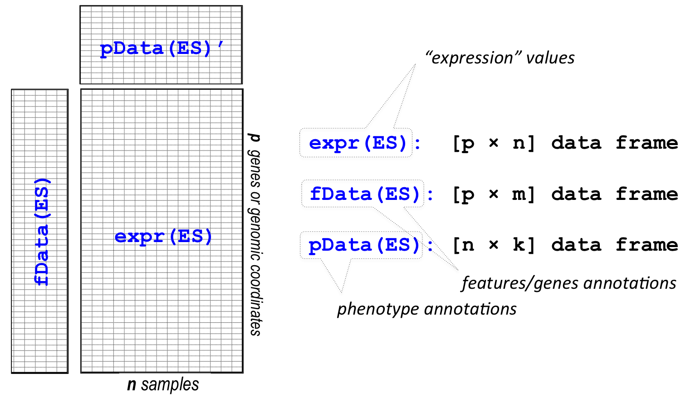

```{r global}
knitr::opts_chunk$set(message=FALSE, warning=FALSE, eval=T, cache=F)
```

# Intro

For today's workshop, we're going to use R to go through a typical bioinformatics analysis workflow. We're going to use common bioinformatics techniques to visualize data and make beautiful figures. 

The data we will analyze is breast cancer RNA-Seq data from [TCGA](https://www.cancer.gov/about-nci/organization/ccg/research/structural-genomics/tcga), a popular publicly-available database for cancer-related datasets. The goal of the analysis will be to identify genes that show significant changes in expression between normal and tumor tissues, followed by identifying the pathways they are associated with. After importing the data and performing some data pre-processing, we will carry out differntial expression analysis and gene set enrichment analysis.

Main steps in today's workshop:

1. Import and pre-process RNA-Seq data
2. Identify differentially-expressed genes between tumor and control samples
3. Identify significantly-enriched pathways in the gene sets


Make sure to have the following packages installed for this workshop:

* `Biobase`
* `dplyr`
* `DESeq2`
* `fgsea`
* `ggplot2`
* `msigdbr`
* `fgsea`

# Working with Expression Set Objects
An expression set is a data object consisting of three entities: the
expression matrix (`exprs`), the phenotye data (`pData`), and the
feature data (`fData`).



We read in the RDS file included in this repo. It corresponds to a subset of samples from a gene expression dataset of breast cancer (BRCA) primary tissue samples from the TCGA project.

```{r, eval=T}
library(Biobase)
library(magrittr)
library(dplyr)
library(ggplot2)
library(ggfortify)
library(plotly)
library(pheatmap)
library(ComplexHeatmap)
library(RColorBrewer)
```

```{r readdata, eval=T}
brca <- readRDS("data/TCGA-BRCA.rds")

# dimensions of the expression data
dim(brca)

# dimensions of the gene annotation
dim(fData(brca))
# first few rows of gene annotations
head(fData(brca)[,c("ensembl_transcript_id", "ensembl_gene_id", "hgnc_symbol")])

# dimensions of the phenotypic annotation
dim(pData(brca))
# first few rows of phenotype
head(pData(brca)[,c("patient_id", "sample_type", "tumor_subtype")])

# how many of each sample type?
table(pData(brca)$sample_type)

# how many tumor subtypes?
table(pData(brca)$tumor_subtype)
```

### Log transform the data set
```{r}
exprs(brca) <- log2(exprs(brca) + 1)
exprs(brca)[1:5,1:5]
```

### PCA

Start by ranking genes based on their variation across samples

```{r}
row.var <- sort(apply(exprs(brca), 1, var), decreasing=TRUE)
head(row.var)
```

To save time, we'll run PCA on the top 2500 most variable genes

```{r}
df <- brca[names(row.var)[1:2500]] %>%
      exprs() %>%
      t() %>%
      data.frame()
    
pca <- prcomp(df)
pca.summary <- summary(pca)
pca.summary$importance[,1:5]
```

### 2-D Plot

```{r}
df$tumor_subtype <- brca$tumor_subtype
autoplot(pca, data=df, colour='tumor_subtype')
```

### 3-D Plot

```{r}
df.pca <- cbind(pca$x[,c(1:3)], brca$tumor_subtype) %>%
          as.data.frame() %>%
          set_colnames(c("PC1", "PC2", "PC3", "tumor_subtype"))

head(df.pca)

p <- plot_ly(df.pca,
             x = ~PC1,
             y = ~PC2,
             z = ~PC3,
             type="scatter3d",
             mode = "markers",
             color = ~tumor_subtype,
             marker = list(size = 3))

p
```

### Challenge: Do it in 4-D

### Heatmap

#### Basic Heatmap with annotations

First, let's draw a heatmap for the **top 100 most variable genes**. This could be done easily with `pheatmap`.
You will need to:
* Hide the row and column names (genes and samples respectively) as there are too many
* Add row annotation as color bars for the **Tumor Subtype** and the **Sample Type**
* Make sure to scale by each gene so the colors make sense
# Hint: it is always adviced to use red for high values and blue for low values in heatmaps

```{r}
dat <- brca[names(row.var)[1:100]]
pheatmap(exprs(dat),
         color = rev(brewer.pal(11, "RdBu")),
         annotation_col = data.frame(Tumor_Subtype = pData(dat)$tumor_subtype,
                        Sample_Subtype = pData(dat)$sample_type, 
                        row.names = row.names(pData(dat))),
         show_rownames = F,
         show_colnames = F,
         clustering_distance_rows = "euclidean", 
         clustering_distance_cols="euclidean",
         scale= "row"
)
```

#### Heatmap with marginal plots

Next, with the same set of genes, let's add some marginal plots.
You will need to:
* Plot PC 1 and 2 as line charts on the top of the heatmap to see if there is any association of PCs to tumor subtypes
* Plot the mean expression of each gene as bar charts on the right of the plot
* Split the heatmap into reasonable number of clusters for row and columns (using `k-means partitioning`) to see if each cluster contains certain tumor subtypes

The package we will be using is called `ComplexHeatmap`. While other packages like `superheat` or `pheatmap` could serve similar purposes, the `ComplexHeatmap`, as the name suggests, provide the most comprehensive functionality for drawing a complicated heatmap with tons of information. Once you got familiar with it, it will be relatively easy to learn the other packages.

```{r}
ca <- HeatmapAnnotation(Tumor_Subtype = pData(dat)$tumor_subtype,
                        Sample_Subtype = pData(dat)$sample_type, 
                        annotation_name_side = "left",
                        PC1 = anno_lines(pca$x[,1]),
                        PC2 = anno_lines(pca$x[,2]))

ra <- rowAnnotation(Mean = anno_barplot(apply(exprs(dat), 1, mean)))

Heatmap(exprs(dat),
        show_row_names = FALSE,
        show_column_names = FALSE,
        column_title = "TCGA BRCA Samples",
        row_title = "Top 100 Variable Genes",
        top_annotation = ca,
        right_annotation = ra,
        column_km = 5,
        row_km = 3)
```


# Data Wrangling Questions

## Example Dataset

```{r}
genes <- c("FOXA1","MLPH","AR","GATA3","DNALI1","FAM47E","RHOB","SPDEF",
"SLC7A8","TTC6","CA12","SMIM14","C5AR2","SIDT1","NOSTRIN","CCDC125",
"FAM198B-AS1","TBC1D9","SLC44A4","DYNLRB2","THSD4","FAM214A","GTF2IP7","SLC22A5",
"CCDC170")

pcs <- brca[genes,] %>%
       exprs() %>%
       t() %>%
       data.frame() %>%
       prcomp() %>%
       .[["x"]]
    
df <- cbind(pcs[,"PC1",drop=F], pData(brca))

head(df)
```

## Example
```{r}
ex1 <- df %>%
       filter(!is.na(tumor_subtype)) %>%
       group_by(tumor_subtype) %>%
       summarize(PC1_mean = mean(PC1, na.rm=T))

print(ex1)

ggplot(data=ex1, aes(x=tumor_subtype, y=PC1_mean)) +
geom_point(aes(shape=tumor_subtype, color=tumor_subtype), size=10)+
ylab("PC1  ~ Basal Genes") +
xlab("Tumor Subtype") +
labs(title="Important Genes", 
     subtitle="Average PC1 Across Tumor Subtypes",
     caption="Figure 1: Example of data wrangling into ggplot")

```

### Q1
Make a boxplot of PC1 across tumor subtypes.
```{r, echo=F}
df %>%
filter(!is.na(tumor_subtype)) %>%
group_by(tumor_subtype) %>%
ggplot(aes(x=tumor_subtype, y=PC1)) +
geom_boxplot(aes(color=tumor_subtype))+
ylab("PC1 ~ Basal Genes") +
xlab("Tumor Subtype")
```

### Q2
Make a scatter of PC1 across tumor subtypes.
```{r, echo=F}
df %>%
filter(!is.na(tumor_subtype)) %>%
group_by(tumor_subtype) %>%
ggplot(aes(x=tumor_subtype, y=PC1)) +
geom_jitter(aes(color=tumor_subtype))+
ylab("PC1 ~ Basal Genes") +
xlab("Tumor Subtype")
```

### Q3
Make a boxplot of PC1 across tumor stages within each gender.
```{r, echo=F}
df %>%
filter(!is.na(tumor_stage)) %>%
filter(gender %in% c("male", "female")) %>%
group_by(gender) %>%
ggplot(aes(x=gender, y=PC1, fill=tumor_stage)) +
geom_boxplot() +
ylab("PC1 ~ Basal Genes") +
xlab("Gender")
```

### Q4
Make a density plot of PC1 across tumor stages within females.
```{r, echo=F}
df %>%
filter(tumor_stage %in% c("stage i", "stage x")) %>%
filter(gender == "female") %>%
ggplot(aes(PC1)) +
geom_density(aes(fill=tumor_stage), alpha=0.5) + 
ylab("") +
xlab("Density(PC1) ~ Basal Genes")
```

### Q5
Make a correlation plot of PC1 with age.
```{r, message=F, warning=F, echo=F}
df.1 <- df %>%
        mutate(age=as.numeric(age_at_diagnosis)) %>%
        filter(tumor_subtype == "Basal") %>%
        filter(!is.na(age))

x_ <- df.1$age
y_ <- df.1$PC1

r <- cor.test(x_, y_)
text <- paste('\n', strrep(" ", 20), 'cor = ', round(r$estimate, 5), '\n', 
               strrep(" ", 20), 'pval = ', round(r$p.value,5 ), sep="")
minx <- min(x_, na.rm = TRUE)
maxy <- max(y_, na.rm = TRUE)   

ggplot(df.1, aes(x=age, y=PC1)) +
geom_point(na.rm=TRUE) + 
geom_smooth(method=lm, na.rm=TRUE) +
xlab("Age (Days)") +
ylab("PC1 ~ Basal Geness") +
annotate("text", x=minx, y=maxy, label=text, size = 4)
```

